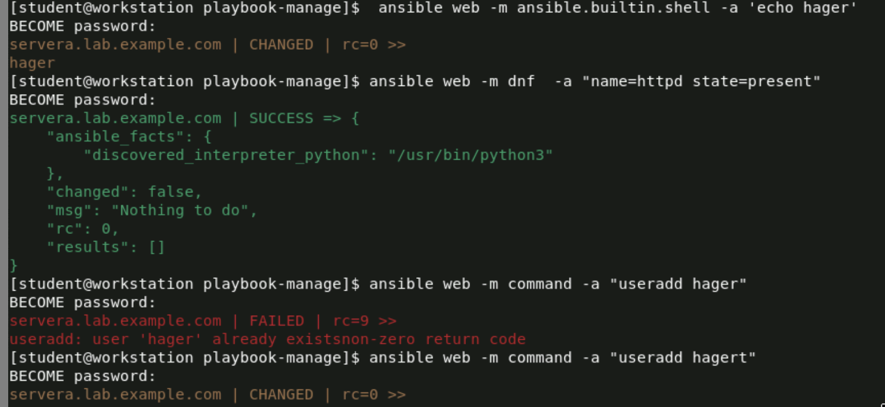

# Ansible Lab: Managing Ad-hoc command and Inventory
This lab demonstrates how to set up and configure Ansible to manage remote servers using ad-hoc command and inventory files. The steps include installing Ansible, configuring the ansible.cfg file, creating an inventory file, and testing commands on remote servers.

## Objective  
Install Ansible and its dependencies.

Configure Ansible settings using ansible.cfg.

Create an inventory file to group servers.

Test Ansible commands on remote servers.

## Steps
### 1. Install Ansible
Install Ansible and ansible-navigator using the following commands:
```bash
sudo dnf install ansible ansible-navigator
```
Verify the installation:
```bash
ansible-navigator --version
```

### 2. Create an Inventory File
Create an inventory file to define the group of servers. For example:
```bash
vim /home/student/playbook-manage/inventory
```
Add the following content to group your server:
```bash
[web]
servera.lab.example.com
```

### 3. Configure ansible.cfg
Create or edit the ansible.cfg file to specify the default inventory, remote user, and privilege escalation settings:
```bash
vim /home/student/playbook-manage/ansible.cfg
```
Add the following content:
```bash
[defaults]
inventory = ./inventory
remote_user = student

[privilege_escalation]
become = true
become_method = sudo
become_user = root
become_ask_pass = true
```
### 4. Test Ansible Commands
Run the following commands to test connectivity and execute tasks on the remote server:

### a. Test Connectivity
```bash
ansible web -m ansible.builtin.shell -a "echo hager"
```
### Output:
```bash
servera.lab.example.com | CHANGED | rc=0 =>
hager
```
### b. Install a Package (e.g., httpd)
```bash
ansible web -m dnf -a "name=httpd state=present"
```
### Output:
```bash
servera.lab.example.com | SUCCESS => {
    "ansible_facts": {
        "discovered_interpreter_python": "/usr/bin/python3"
    },
    "changed": false,
    "msg": "Nothing to do",
    "rc": 0,
    "results": []
}
```
### c. Create a User
```bash
ansible web -m command -a "useradd hager"
```
### Output (if user already exists):
```bash
servera.lab.example.com | FAILED | rc=9 =>
useradd: user 'hager' already exists
non-zero return code
```
If the user does not exist, the output will show:
```bash
servera.lab.example.com | CHANGED | rc=0 =>
```
### output 
