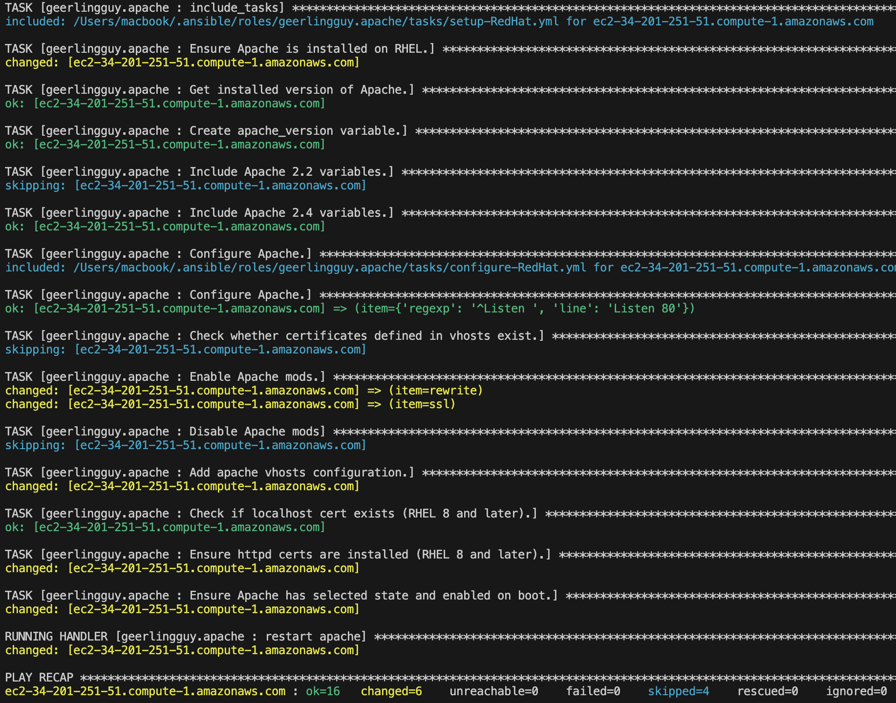
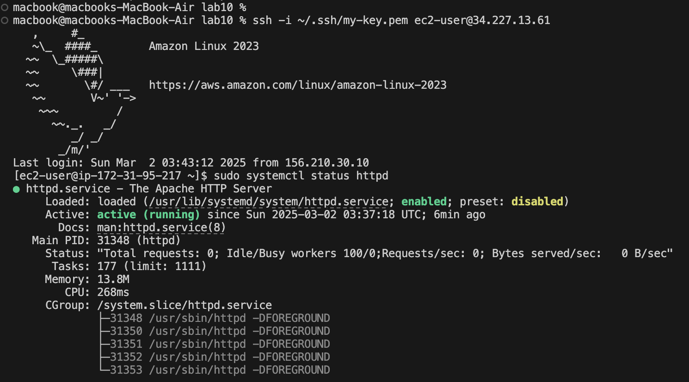
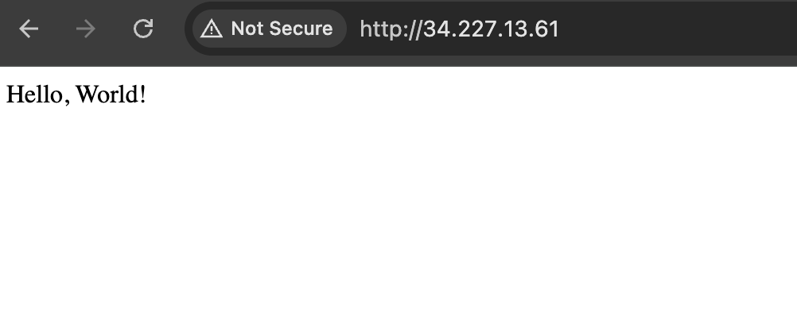

# Ansible AWS Apache Setup
This repository contains an Ansible Task for automated Apache installation on AWS EC2 instances using dynamic inventory. The setup dynamically retrieves EC2 instances, applies configurations, and ensures scalable, automated deployments.

# Features
**✔** Dynamic AWS Inventory – Automatically discovers running EC2 instances.
**✔** Ansible Galaxy Role – Uses geerlingguy.apache to install Apache.
**✔** Automated Setup – Fully scriptable infrastructure provisioning.
**✔** SSH Authentication – Ensures secure connections with private keys.
**✔** GitHub Integration – Project is version-controlled and shareable.

# Project Structure
```bash
ansible-aws-apache/
│── ansible.cfg          # Ansible configuration file
│── aws_ec2.yml          # Dynamic AWS EC2 inventory
│── install_apache.yml   # Ansible playbook to install Apache & serve "Hello, World"
│── templates/
│   └── index.html.j2    # Custom Apache index file
│── README.md            # Project documentation

```

# Install Dependencies
```bash
brew install ansible awscli
pip install boto3 botocore
```
# Configure AWS Credentials
Run:
```bash
aws configure
```

## Configure Ansible Inventory
create aws_ec2.yml:
```bash
---
plugin: amazon.aws.aws_ec2
regions:
  - us-east-1  # Change to your AWS region

keyed_groups:
  - key: tags.Name
    prefix: tag_

compose:
  ansible_host: public_ip_address  # Ensures correct public IP is used

strict: False  # Prevent errors if no instances are found
3️⃣ Set Ansible Configuration
```

## create ansible.cfg:
```bash
[defaults]
inventory = aws_ec2.yml
host_key_checking = False
private_key_file = ~/.ssh/my-key.pem
remote_user = ec2-user
```
## Create install_apache.yml
```bash
---
- name: Install Apache on AWS Instances
  hosts: all
  become: yes  
  roles:
    - geerlingguy.apache

  tasks:
    - name: Copy custom index.html
      template:
        src: templates/index.html.j2
        dest: /var/www/html/index.html
      notify: Restart Apache

  handlers:
    - name: Restart Apache
      service:
        name: apache2
        state: restarted
```

## Install Required Ansible Collections
```bash
ansible-galaxy collection install amazon.aws
```

## Run the Ansible Playbook
```bash
ansible-playbook -i aws_ec2.yml install_apache.yml
```


# Verification
## 1️⃣ Check Apache on the EC2 Instance
```bash
ssh -i ~/.ssh/my-key.pem ec2-user@<public-ip>
systemctl status httpd  
systemctl status apache2  
```



## 2️⃣ Open Apache in Browser
Go to:
```bash
http://<EC2-PUBLIC-IP>
```


