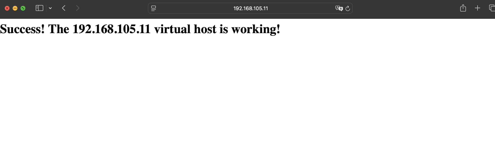

# Apache Setup with Ansible

This repository contains an Ansible playbook to automate the installation and configuration of Apache on an Ubuntu server. It also deploys a custom `index.html` page.

---

## **Repository Contents**
- `playbook.yml`: The Ansible playbook to install and configure Apache.
- `index.html`: A sample HTML file to serve as the default Apache page.

---

## the Inventory File:
Create an inventory file with your target host:
```bash
[web]
192.168.105.11
```
## Run the Playbook:
Execute the playbook:
```bash
ansible-playbook -i inventory playbook.yml
```
Verify the Setup:
Open a browser and navigate to:
```bash
http://<server-ip>
```
## Files
### 1. playbook.yml
This playbook:

Installs Apache.

Creates the document root directory.

Deploys the index.html file.

Enables and starts the Apache service.

Allows HTTP traffic on port 80.

2. index.html
A simple HTML file served as the default page for Apache.

index.html
```bash
<html>
   <head>
       <title>Welcome to 192.168.105.11 !</title>
   </head>
   <body>
       <h1>Success! The 192.168.105.11 virtual host is working!</h1>
   </body>
</html>
```
### output 
