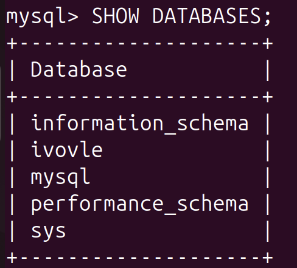
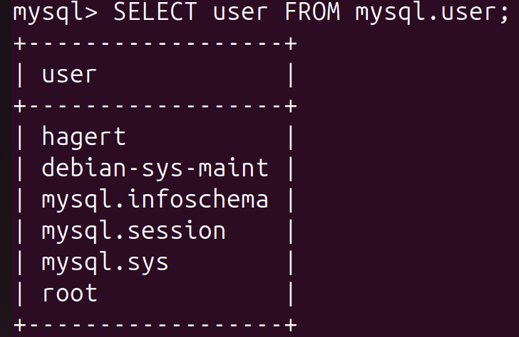
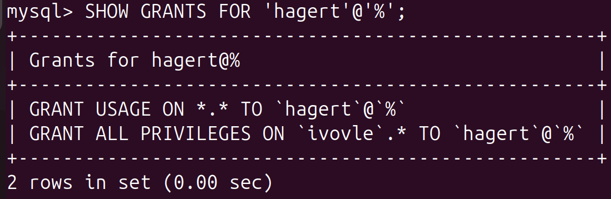

# Ansible Playbook: MySQL Setup
This repository contains an Ansible playbook to automate the installation and configuration of MySQL on a target host. The playbook installs MySQL, creates a database, sets up a user with privileges, and enables remote access to the MySQL server.


## Objective

1. Ansible installation and configuration

2. ssh configuration on the worker nodes(ubuntu)

3. Generating the control node’s(macos) ssh keys

4. Adding the worker nodes(ubuntu) to the inventory file

5. MYSQL installation with ansible

6. Connecting to the database on worker nodes

## steps
### 1-Configure SSH (macos)
```bash
Host ivolve
    HostName 192.168.105.11
    User hager
    IdentityFile ~/.ssh/id_rsa
    IdentitiesOnly yes
```
### 2- Ping the ubuntu to confirm connectivity
```bash
ansible -m ping ivolve :

ivolve | SUCCESS => {
    "ansible_facts": {
        "discovered_interpreter_python": "/usr/bin/python3.12"
    },
    "changed": false,
    "ping": "pong"
}  
```
### 3- lab Structure 
1. ansible.cfg
This file configures Ansible settings and make 
#### vault_password_file: 
the file containing the Vault password for automation
```bash
[defaults]
inventory = ./inventory
vault_password_file = .vault_pass
```
2. inventory
This file defines the target hosts for the playbook
```bash
[web]
ivolve
```
3. vault.yml
This file stores  database username and password encrypted using Ansible Vault

```bash
ansible-vault create vault.yml

db_user: "hagert"
db_pass: "1234"
```
4. Playbook Content
The playbook performs the following tasks:
   - Updates the APT cache.
   - Installs MySQL Server, MySQL Client, and required dependencies.
   - Starts and enables the MySQL service. 
   - Creates a MySQL user with all privileges on the ivovle database.
   - Creates the ivovle database. 
   - Configures MySQL to allow remote access by modifying the bind-address  in the MySQL configuration file.
   - Restarts the MySQL service to apply changes.

5. Run the Playbook
when you run playbook, Ansible will automatically use the password from .vault_pass to decrypt any Vault-encrypted files:
```bash
ansible-playbook playbook.yml
```

## Verification
Log in to the MySQL server and Check if the ivolve database was created


================================

,user was created

================================
and verify the user's privileges



