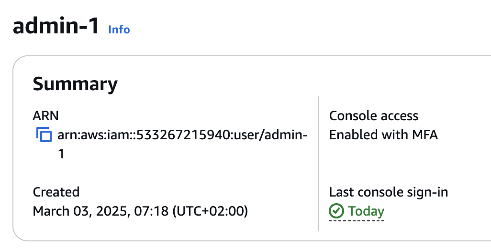
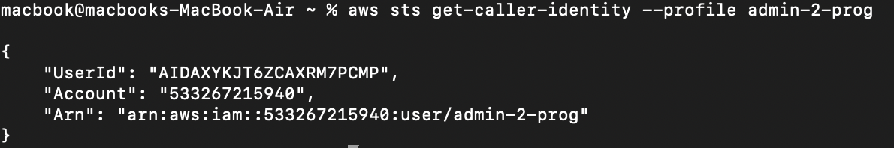
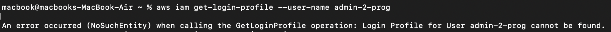
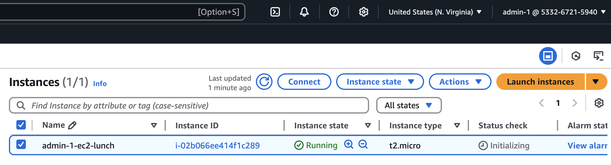
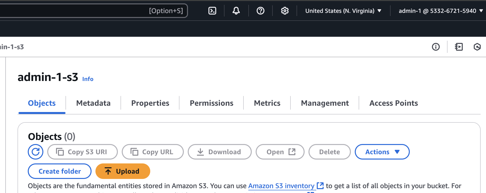
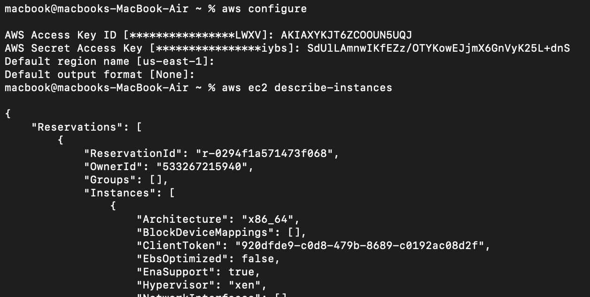
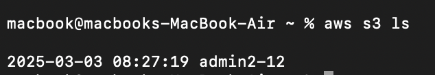
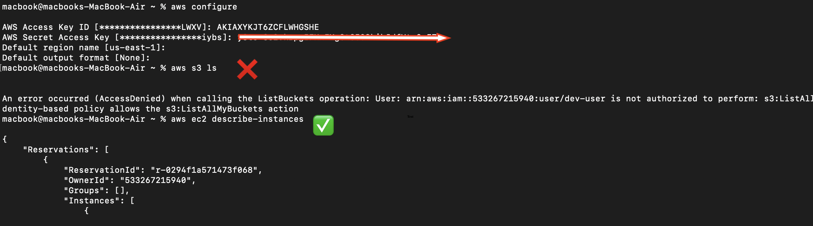
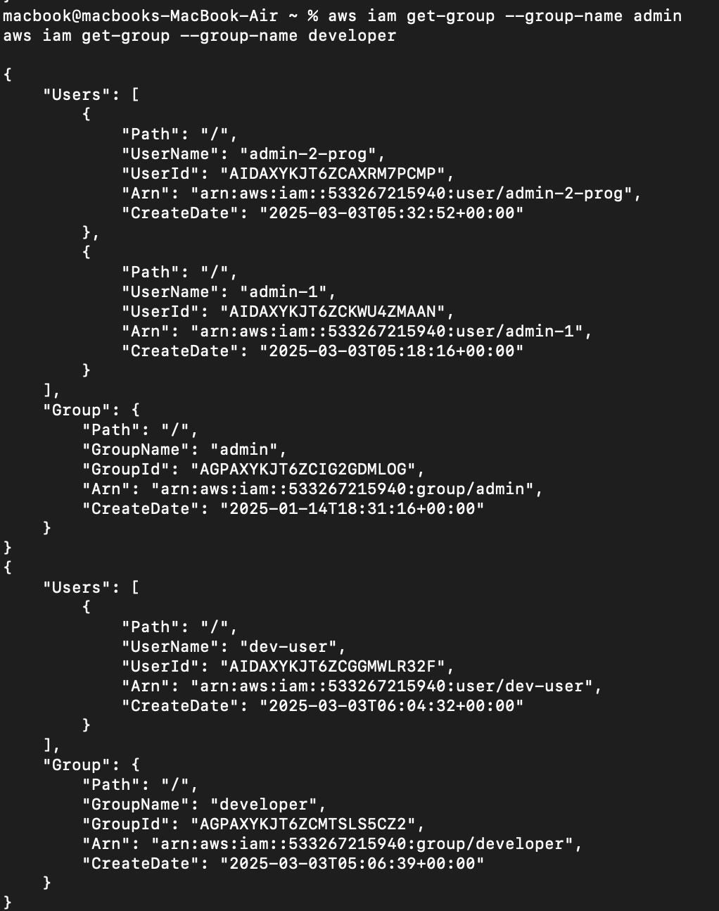

# AWS IAM Security Setup 🚀

This documents the setup of an AWS account with IAM security best practices, including user creation, permissions, and access verification.
----------------------------------------------------------------
## **1️⃣ AWS Account Creation & Billing Alarm Setup**

### **Step 1: Create an AWS Account**

### **Step 2: Set a Billing Alarm**

## **2️⃣ IAM User & Group Setup**
### **Step 3: Create IAM Groups**
 1- Create admin Group (Full Access):

 2- Create developer Group (EC2-Only Access):

## **3️⃣ Create IAM Users**
### **Step 4: Create admin-1 (Console Access & MFA Enabled)**

### **Step 5: Create admin-2-prog (CLI-Only Access)**

### **Step 6: Create dev-user (Console & CLI Access)**

## **4️⃣ Verify IAM User Permissions**
### **Step 7: Test admin-1 (Console Access)**
**✔** Login to AWS Console as admin-1
Access EC2(lunching ec2): 

**✔** Access S3: 
Verify bucket access

### **Step 8: Test admin-2-prog (CLI Access)**
**✔** Configure AWS CLI:
aws ec2 describe-instances

**✔** Verify S3 Access:

### **Step 9: Test dev-user (Console & CLI)**

aws ec2 describe-instances  # ✅  Work
aws s3 ls                   # ❌  Fail (Access Denied)

## **5️⃣ List All Users & Groups**

## **✅ Final Access Summary**

| User           | Group      | Access Type       | MFA | Permissions  |
|---------------|-----------|-------------------|-----|-------------|
| `admin-1`     | admin     | Console Only      | ✅  | Full Access |
| `admin-2-prog` | admin     | CLI Only          | ❌  | Full Access |
| `dev-user`    | developer | Console & CLI     | ❌  | EC2-Only    |

