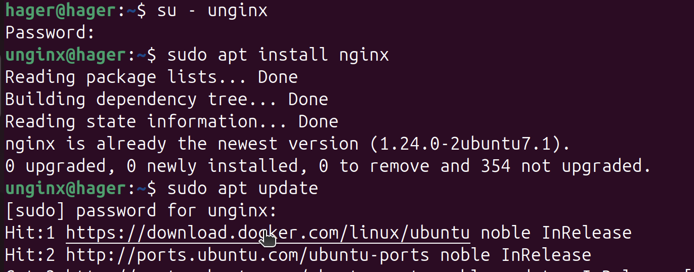

# Lab 1: User and Group Configuration for Passwordless `sudo apt install nginx`

## Objective
In this lab, i will:
1. Create a user and a group.
2. Allow the user to run `sudo apt install nginx` without a password.
3. Ensure that all other `sudo` commands require a password.

---

## Steps

### 1. Create a Group
Create a new group called `gnginx`:
```bash
sudo addgroup gnginx
```
### 2. Create a User and Add to the Group
Create a new user called unginx and add them to the gnginxgroup:
```bash
sudo adduser unginx
sudo usermod -aG gnginx unginx
```
### 3. Modify the sudoers File
Edit the sudoers file to allow members of the gnginx group to run sudo apt install nginx without a password:
```bash
sudo visudo
```
Add the following line at the end of the file:
```bash
%gnginx ALL=(ALL) NOPASSWD: /usr/bin/apt install nginx
%gnginx ALL=(ALL) ALL

```
### 4. Test the Configuration
Switch to the unginx account:

```bash
su - unginx
```
Run the following command to test if sudo apt install nginx works without a password:
```bash
sudo apt install nginx
sudo apt update
```
### output 
