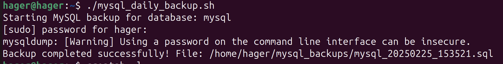

# Lab 2: Automate MySQL Database Backups

## Overview
This Lab automates the process of taking daily backups of a MySQL database at 5:00 PM. The backup script creates a compressed .sql file and deletes backups older than 7 days. The script is scheduled using cron.

## Steps
### Step 1: Install MySQL:
```bash
sudo apt update
sudo apt install mysql-server
sudo systemctl start mysql
sudo systemctl enable mysql
```
### Step 2: Create the Backup Script
Create a backup script:
```bash
 sudo nano /mysql_daily_backup.sh
```
```bash
#!/bin/bash

# Database credentials
DB_USER="backupuser"        
DB_PASSWORD="********" 
DB_NAME="your_database"      

# Backup directory (create this first)
BACKUP_DIR="home/user/backups"
mkdir -p "$BACKUP_DIR"

# Backup filename with timestamp
BACKUP_FILE="$BACKUP_DIR/${DB_NAME}_$(date +%Y%m%d_%H%M%S).sql"

# Perform MySQL dump
mysqldump -u "$DB_USER" -p"$DB_PASSWORD" "$DB_NAME" > "$BACKUP_FILE"

# Check for success
if [ $? -eq 0 ]; then
    echo "$(date): Backup succeeded: $BACKUP_FILE" >> /var/log/mysql_backup.log
    gzip "$BACKUP_FILE"  # Optional: Compress the backup
else
    echo "$(date): Backup failed!" >> /var/log/mysql_backup.log
    exit 1
fi

# Delete backups older than 7 days
find "$BACKUP_DIR" -type f -name "*.sql.gz" -mtime +7 -exec rm {} \;
```
### Step 3: Make the Script Executable
```bash
chmod +x mysql_daily_backup.sh
```
### Step 4: Schedule with Cron
1-Open the crontab editor:
```bash
crontab -e
```
2-Add the following line to schedule the script to run daily at 5:00 PM:
```bash
0 17 * * * /home/user/mysql_daily_backup.sh >> /var/log/mysql_backup.log 2>&1
```
## Verification
### Test the Script Manually:
```bash
./mysql_daily_backup.sh
```
### output 



