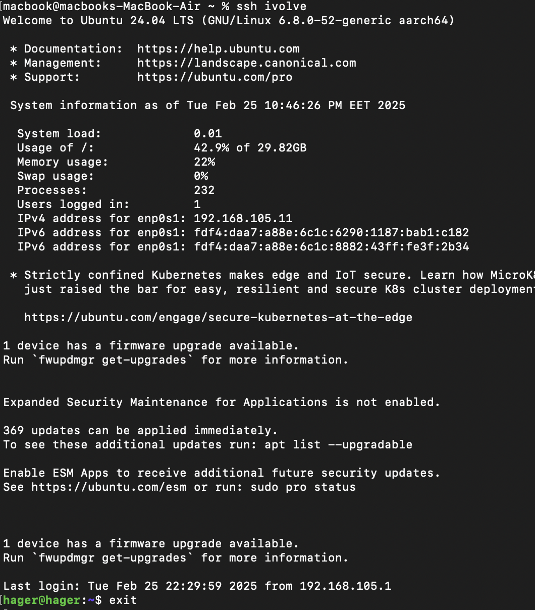

# SSH Key Configuration Lab

A guide to setting up passwordless SSH access between a macOS host and an Ubuntu VM using public-key authentication.

## Objective
Configure SSH to connect to an Ubuntu VM using `ssh ivolve` without specifying:
- Username
- IP Address
- Key file
- Password/Passphrase

## Configuration Steps

### 1. Generate SSH Key Pair (macOS)
```bash
ssh-keygen -t rsa -b 4096 -f ~/.ssh/id_rsa
```
### 2. Copy Public Key to Ubuntu VM
```bash
ssh-copy-id -i ~/.ssh/id_rsa.pub hager@192.168.105.11
```
### 3. Configure SSH Client (macOS)
Create/edit ~/.ssh/config:
```bash
Host ivolve
    HostName 192.168.105.11
    User hager
    IdentityFile ~/.ssh/id_rsa
    IdentitiesOnly yes
```
### 4. Enable Passphrase Caching 
```bash
eval "$(ssh-agent -s)"
ssh-add --apple-use-keychain ~/.ssh/id_rsa
```
### 5. Test Connection
```bash
ssh ivolve
```
### output 
